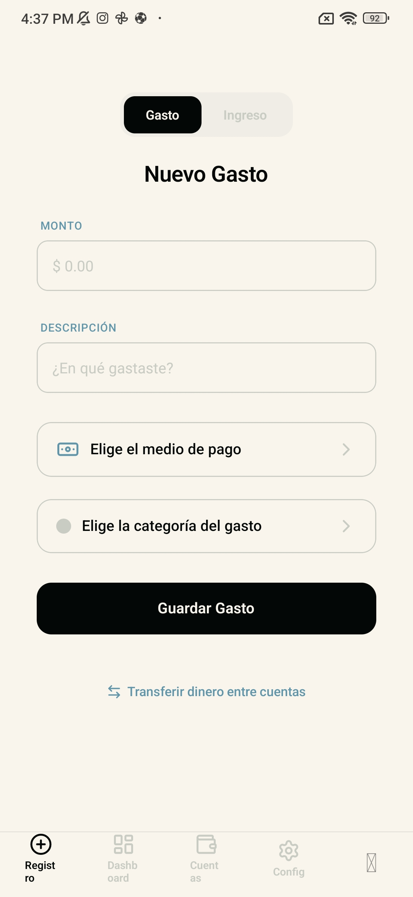
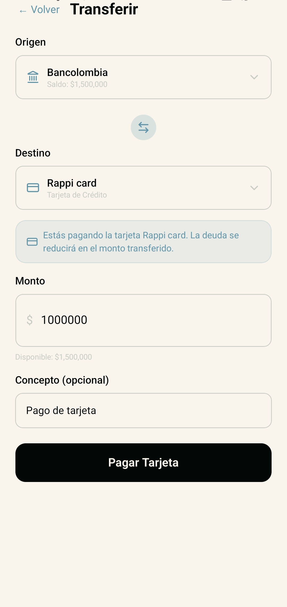
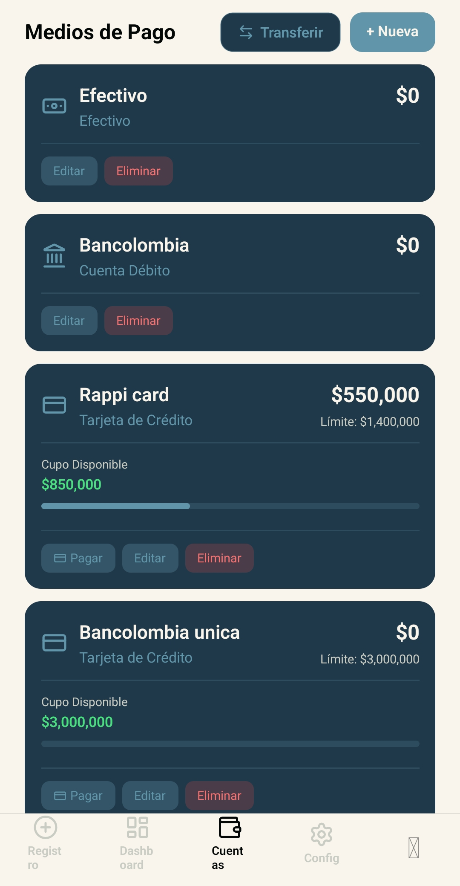
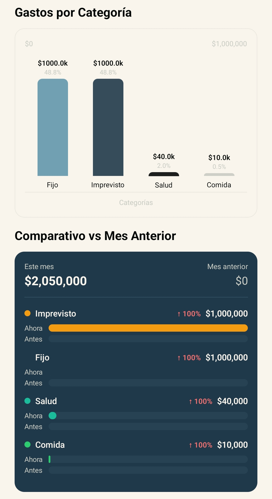

# Conciencia Financiera

Aplicación de finanzas personales orientada a la **fricción cero**: registrar gastos e ingresos en segundos, controlar múltiples medios de pago (efectivo, débito y tarjetas de crédito), visualizar hábitos de consumo y alcanzar metas de ahorro.

---

## Dos versiones, un mismo producto

Este repositorio incluye **dos formas de usar la app**, según dónde y cómo quieras ejecutarla:

| Versión | Dónde corre | Stack | Ideal para |
|---------|-------------|-------|------------|
| **Servidor (nube)** | VPS / Linux con Docker | React Native (PWA) + **Python Django** + PostgreSQL | Uso web, multi-dispositivo, datos centralizados en la nube |
| **APK local (Android)** | Directamente en el celular | React Native (Expo) + **SQLite** + TypeScript | Uso offline, sin internet, datos 100 % en tu dispositivo |

### Versión en servidor (Python)

Desplegada en un servidor Linux con **Django REST Framework**, **PostgreSQL** y **nginx**. El frontend se sirve como PWA y se comunica con la API mediante JWT.

- Autenticación por correo y contraseña
- Sincronización de datos entre sesiones
- Documentación de despliegue: [`docs/deploy-linux.md`](docs/deploy-linux.md)

```bash
docker-compose up -d
```

### Versión APK local (Android)

Adaptada para instalarse como **APK en Android** sin depender de un backend remoto. Toda la lógica financiera y los datos viven en **SQLite** dentro del teléfono.

- Sin conexión a internet requerida
- Onboarding, cuentas, categorías, metas y dashboard funcionan offline
- Generación del APK con EAS Build:

```bash
cd frontend
eas build --platform android --profile preview
```

---

## Capturas

### Registra gastos al instante

Sin formularios eternos ni pantallas de carga. Abres la app, ingresas el monto y listo — diseñada para que registrar un gasto tome segundos, no minutos.



---

### Todos tus medios de pago en un solo lugar

Efectivo, cuentas de débito y tarjetas de crédito. Agrega las que uses, consulta saldos al momento y elige con un toque desde dónde sale cada movimiento.



---

### Visualiza en qué se va tu dinero

Gráficos claros por categoría para identificar de un vistazo tus rubros de mayor gasto y tomar decisiones con datos, no con suposiciones.



---

### Paga tus tarjetas y recupera cupo

Transfiere desde efectivo o débito hacia tus tarjetas de crédito, reduce la deuda y ve cómo se repone tu cupo disponible — todo desde la misma app.



---

## Stack tecnológico

| Capa | Servidor (nube) | APK local (Android) |
|------|-----------------|---------------------|
| **Frontend** | Expo + React Native (PWA) | Expo + React Native (APK) |
| **Backend / datos** | Django REST + PostgreSQL | SQLite + TypeScript |
| **Auth** | JWT | Perfil local (sin login remoto) |
| **Infraestructura** | Docker Compose + nginx | EAS Build |

## Paleta de colores

| Color | Hex | Uso |
|-------|-----|-----|
| NOIR | `#030706` | Texto principal, fondos oscuros |
| DENIM | `#20394a` | Tarjetas y contenedores |
| BONE | `#f9f5ed` | Fondo principal |
| STEEL | `#6196aa` | Acentos y botones secundarios |
| CONCRETE | `#c9ccc3` | Bordes y placeholders |

## Estructura del proyecto

```
SDD/
├── backend/              # Django REST Framework (versión servidor)
├── frontend/             # Expo React Native (PWA + APK)
│   ├── app/              # Pantallas (expo-router)
│   ├── src/
│   │   ├── db/           # SQLite — versión APK local
│   │   ├── services/     # Lógica de negocio
│   │   └── components/   # UI reutilizable
│   └── public/           # Imágenes promocionales (im-1 … im-4)
├── docs/                 # Guías de despliegue
├── docker-compose.yml    # Orquestación versión servidor
├── .specs/               # Especificaciones
├── .design/              # Diseño técnico y UI/UX
└── .tasks/               # Plan de tareas
```

## Instalación rápida

### Versión servidor

```bash
git clone https://github.com/waldooCreator/Conciencia_financiera.git
cd Conciencia_financiera
cp .env.example .env
docker-compose up -d
docker-compose exec backend python manage.py migrate
```

### Versión APK (desarrollo local)

```bash
cd frontend
npm install
npx expo start --android
```

## Documentación

- [Especificaciones](.specs/specs.md)
- [Diseño técnico](.design/design.md)
- [Plan de tareas](.tasks/tasks.md)
- [Despliegue en Linux](docs/deploy-linux.md)

## Licencia

Proyecto de uso educativo y personal.

---

## Documentación del proyecto (informe académico)

### Nombre de la aplicación y descripción general

**Nombre:** Conciencia Financiera

**Descripción:** Aplicación móvil de finanzas personales que permite al usuario registrar ingresos y gastos con mínima fricción, administrar múltiples medios de pago (efectivo, débito y tarjetas de crédito), visualizar KPIs de consumo por categoría, comparar gastos entre meses, definir metas de ahorro y realizar transferencias — incluyendo el pago de deudas en tarjetas de crédito con actualización automática del cupo disponible.

El proyecto se desarrolló en **dos variantes**: una versión con backend en la nube (Python/Django) y una versión **APK local para Android** con SQLite, pensada para funcionar sin conexión a internet.

---

### Integrantes del equipo

| Nombre completo | Código |
|-----------------|--------|
| Walter Esteban Velasco Contreras | — |
| Juan Sebastián Gallego Carrillo | — |

---

### Tecnologías utilizadas

#### Versión servidor (nube)

| Tecnología | Versión |
|------------|---------|
| Python | 3.11+ |
| Django | 5.x |
| Django REST Framework | 3.14+ |
| SimpleJWT | 5.3+ |
| PostgreSQL | 15 |
| Docker / Docker Compose | 3.8 |
| nginx | — |
| Gunicorn | 21.2+ |

#### Versión APK local (Android)

| Tecnología | Versión |
|------------|---------|
| TypeScript | 6.0.3 |
| React | 19.2.3 |
| React Native | 0.85.3 |
| Expo SDK | 56.0.0 |
| expo-router | 56.2.7 |
| expo-sqlite | 56.0.4 |
| NativeWind (Tailwind) | 4.2.4 |
| EAS Build | — |

#### Herramientas compartidas

| Herramienta | Uso |
|-------------|-----|
| Git / GitHub | Control de versiones |
| Node.js | 18+ (entorno frontend) |
| Metro Bundler | Empaquetado React Native |

---

### Arquitectura de la aplicación

#### Versión servidor (nube)

```
┌─────────────┐     HTTPS/JWT      ┌──────────────────┐     SQL      ┌────────────┐
│   Cliente   │ ◄──────────────► │  Django REST API │ ◄──────────► │ PostgreSQL │
│  PWA / Web  │                   │  (Gunicorn)      │              │            │
└─────────────┘                   └──────────────────┘              └────────────┘
                                           ▲
                                           │ proxy
                                    ┌──────┴──────┐
                                    │    nginx    │
                                    └─────────────┘
```

#### Versión APK local (Android)

```
┌─────────────────────────────────────────────┐
│              APK (Expo / React Native)       │
│  ┌──────────┐  ┌────────────┐  ┌─────────┐  │
│  │ Pantallas│→ │ Servicios  │→ │ SQLite  │  │
│  │ (UI/UX)  │  │ TypeScript │  │ (local) │  │
│  └──────────┘  └────────────┘  └─────────┘  │
└─────────────────────────────────────────────┘
         Sin dependencia de red externa
```

**Capas (APK local):**

1. **Presentación** — pantallas con Expo Router y NativeWind
2. **Lógica de negocio** — validaciones de saldo, crédito, transferencias y KPIs en TypeScript
3. **Persistencia** — base de datos SQLite en el dispositivo (`expo-sqlite`)

---

### Especificaciones funcionales (features implementadas)

| Módulo | Funcionalidad | Servidor | APK local |
|--------|---------------|:--------:|:---------:|
| Onboarding | Configuración inicial (sueldo, cuentas, metas) | ✅ | ✅ |
| Registro de gastos/ingresos | Captura rápida con categoría y medio de pago | ✅ | ✅ |
| Medios de pago | CRUD de efectivo, débito y crédito | ✅ | ✅ |
| Tarjetas de crédito | Límite, deuda, cupo disponible, cuotas | ✅ | ✅ |
| Transferencias | Entre cuentas y pago de tarjetas | ✅ | ✅ |
| Categorías | CRUD + categorías predefinidas (seed) | ✅ | ✅ |
| Dashboard | Ingresos vs gastos, deuda, gráficos | ✅ | ✅ |
| Comparativo mensual | Gasto por categoría vs mes anterior | ✅ | ✅ |
| Metas de ahorro | CRUD, agregar/retirar fondos, progreso | ✅ | ✅ |
| Historial | Listado y eliminación de transacciones | ✅ | ✅ |
| Autenticación JWT | Login/registro con email | ✅ | — |
| Modo offline | Cola de sincronización | ✅ | ✅ (nativo) |

---

### Instrucciones de instalación y ejecución

#### Versión servidor (Python + Docker)

**Requisitos:** Docker, Docker Compose, Git

```bash
git clone https://github.com/waldooCreator/Conciencia_financiera.git
cd Conciencia_financiera
cp .env.example .env
docker-compose up -d
docker-compose exec backend python manage.py migrate
```

Acceso: `http://localhost` (frontend PWA) · API: `http://localhost/api/`

#### Versión APK local (Android)

**Requisitos:** Node.js 18+, cuenta Expo (para EAS Build)

```bash
cd frontend
npm install
npx expo start --android        # desarrollo con Expo Go / emulador
eas build --platform android --profile preview   # generar APK
```

Instalar el `.apk` descargado en el dispositivo Android. No requiere backend ni internet.

---

### Capturas de pantalla

Pantallas principales de la aplicación en funcionamiento:

| Pantalla | Descripción | Captura |
|----------|-------------|---------|
| **Registro de gastos** | Formulario de fricción cero para ingresar gastos e ingresos al instante |  |
| **Cuentas / Medios de pago** | Listado de efectivo, débito y crédito con opción de agregar nuevas cuentas |  |
| **Dashboard** | Gráfico de gastos por categoría y resumen financiero del mes |  |
| **Transferencias / Pago TC** | Pago de tarjetas de crédito y reposición de cupo disponible |  |

**Otras pantallas implementadas** (sin captura dedicada en este repositorio):

| Pantalla | Ruta | Función |
|----------|------|---------|
| Splash / Bienvenida | `/` | Pantalla de inicio con logo |
| Onboarding | `/onboarding` | Configuración paso a paso del primer uso |
| Dashboard | `/(tabs)/dashboard` | KPIs, comparativo y transacciones recientes |
| Configuración | `/(tabs)/settings` | Perfil, accesos a categorías, metas e historial |
| Categorías | `/categories` | Gestión de rubros de gasto |
| Metas de ahorro | `/goals` | Creación y seguimiento de objetivos |
| Transacciones | `/transactions` | Historial completo con filtros |

---

### Endpoints de servicios web consumidos

> Aplica únicamente a la **versión servidor (nube)**. La versión APK local **no consume endpoints**; usa SQLite en el dispositivo.

**Base URL:** `https://<servidor>/api`

#### Autenticación

| Método | Endpoint | Descripción |
|--------|----------|-------------|
| `POST` | `/api/users/register/` | Registro de usuario |
| `POST` | `/api/token/` | Login (obtener JWT) |
| `POST` | `/api/token/refresh/` | Renovar access token |
| `GET` / `PATCH` | `/api/users/profile/` | Perfil del usuario autenticado |

#### Salud

| Método | Endpoint | Descripción |
|--------|----------|-------------|
| `GET` | `/api/health/` | Health check del backend |

#### Recursos REST (CRUD + acciones)

| Recurso | Endpoints base | Acciones adicionales |
|---------|----------------|----------------------|
| **Wallets** | `GET/POST /api/wallets/` · `GET/PATCH/DELETE /api/wallets/{id}/` | — |
| **Categorías** | `GET/POST /api/categories/` · `GET/PATCH/DELETE /api/categories/{id}/` | `POST /api/categories/seed_defaults/` |
| **Transacciones** | `GET/POST /api/transactions/` · `GET/PATCH/DELETE /api/transactions/{id}/` | `GET /api/transactions/summary/` · `GET /api/transactions/comparison/` |
| **Metas** | `GET/POST /api/goals/` · `GET/PATCH/DELETE /api/goals/{id}/` | `POST /api/goals/{id}/add_funds/` · `POST /api/goals/{id}/withdraw_funds/` |

Todas las rutas protegidas requieren header: `Authorization: Bearer <access_token>`

---

### Conclusiones y aprendizajes

- Aprendimos a desarrollar aplicaciones móviles con **React Native y Expo**, desde la interfaz hasta generar un **APK instalable en Android**.
- Comprendimos la diferencia entre una arquitectura **cliente-servidor** (Django + PostgreSQL en la nube) y una arquitectura **local-first** (SQLite en el dispositivo), y cuándo conviene cada una.
- Desarrollar con **Spec-Driven Development** nos ayudó a mantener orden entre especificaciones, diseño e implementación.
- Fue gratificante resolver retos reales como el manejo de **tarjetas de crédito** (deuda, cupo, pagos) y ver la app funcionando de punta a punta en un celular físico.
- En general, nos gustó aprender a desarrollar en mobile y poder **descargar un APK propio** que funciona sin depender de un servidor externo.

